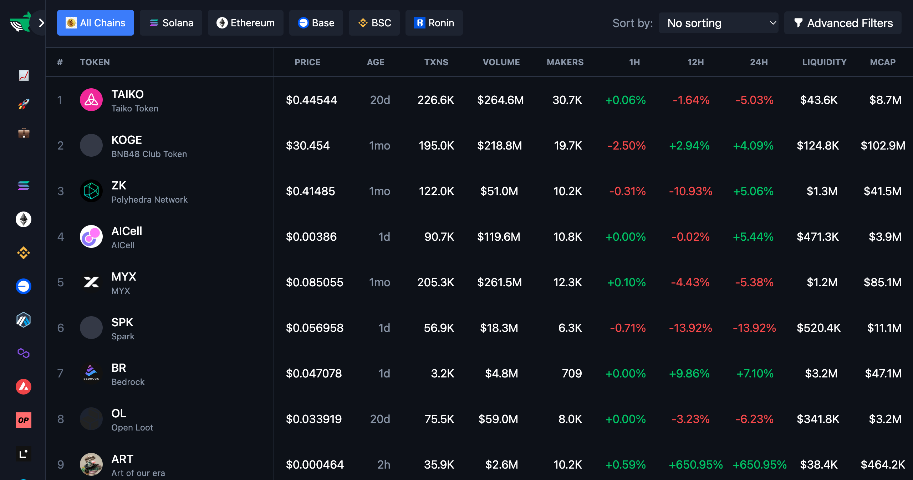
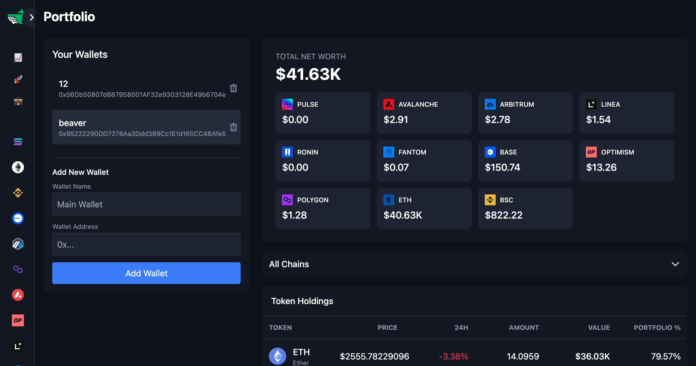
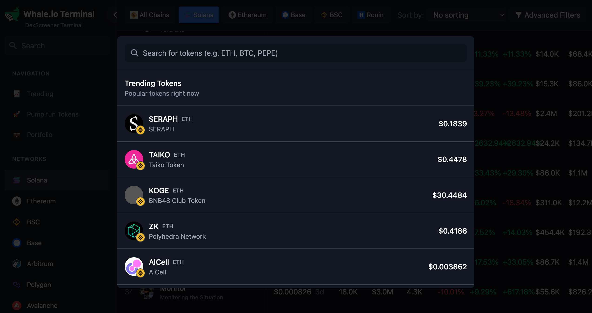
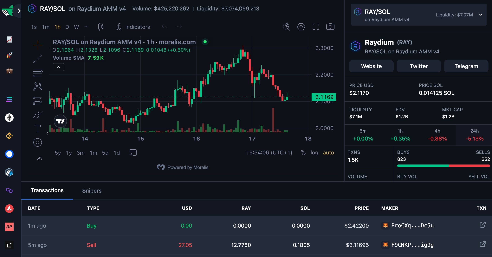

# Lux - Your Web3 Portfolio Tracker

Lux is a comprehensive web3 portfolio tracker that allows you to monitor your assets across multiple chains, discover trending tokens, and analyze token performance.

## Features

### Multi-Chain Support

Lux supports a wide range of popular blockchain networks, including Ethereum, Binance Smart Chain, Polygon, Arbitrum, Avalanche, Fantom, Optimism, Base, Linea, Ronin, and Solana.


_The app supports multiple chains_

### Portfolio Tracking

Easily track your token holdings, net worth, and transaction history across all supported chains in one unified dashboard.


_Track your portfolio across multiple chains_

### Trending Tokens

Discover the hottest trending tokens and gain insights into their performance, market capitalization, and trading volume.


_Discover trending tokens_

### Token Analysis

Analyze token charts, token holder insights, and recent transactions to make informed investment decisions.


_Analyze token performance_

## Usage

1.  Clone the repository:

    ```bash
    git clone https://github.com/your-username/Lux.git
    ```

2.  Install dependencies:

    ```bash
    npm install
    ```

3.  Run the app in development mode:

    ```bash
    npm start
    ```

4.  Open [http://localhost:3000](http://localhost:3000) to view it in the browser.

## Contributing

Contributions are welcome! Please feel free to submit pull requests or open issues to suggest improvements or report bugs.

## License

MIT
